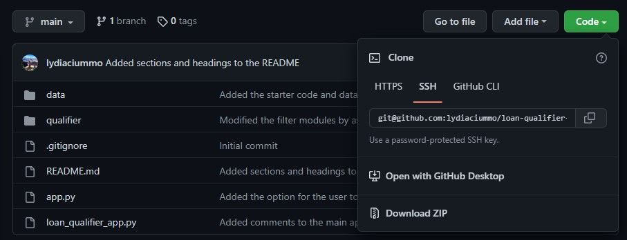
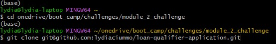
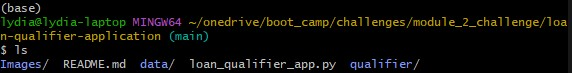
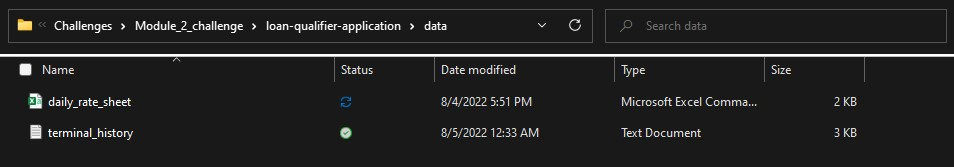
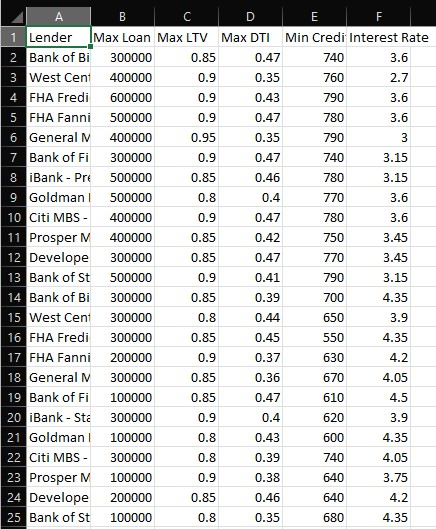
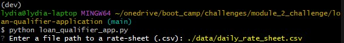
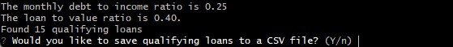
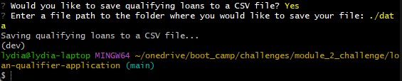

# Loan Qualifier Application

This is a command line application that allows users to filter through a list of home loans from a CSV file to find loans that they qualify for based on their credit score, their debt-to-income ratio, and the loan-to-value ratio of the home they would like to purchase. It also gives the user the option to save the information for the loans they qualified for to a CSV file in a folder of their choosing.

With this program, the user will easily be able to rule out the loans that they do not qualify for and therefore will not waste time considering those loans. The CSV file containing the qualifying loans that this program generates could also then be filtered through a different program to help the user find the loan that best fits their needs.

---

## Technologies

* Python 3.7
* Python *fire*, *questionary*, *os*, *pathlib*, *csv*, and *sys* libraries
* Command line shell such as Git Bash, Powershell, or Terminal for Mac

---

## Installation Guide

Clone the repository to your local file system. To do this, first copy the repository link

Open your terminal, navigate to the directory where you want to put the repository, and type `git clone <link>`

The repository should now be cloned to your local directory

---

## Usage

To use the application to find qualifying loans, copy and paste a CSV file containing loan data into the ./data directory of the repository. 

Note: the loan data must be in this order: Lender, Max Loan Amount, Max LTV, Max DTI, Min Credit Score, Interest Rate.

In the terminal, from the main directory of the repository, run the application by typing the command `python loan_qualifier_app.py`. You will receive a prompt to enter a file path to a rate-sheet. Note that the file path must be relative to the main directory.

You will then be prompted to enter your information so that the program can determine your eligibility for the loans.

After you enter your information, the program will return a series of print statements informing you of your debt-to-income ratio, the loan-to-value ratio of the home, and how many loans you qualify for. It will then ask if you would like to save the list of qualifying loans to a CSV file.

If you select yes, you will be prompted to enter a file path to the folder where you want your file to be saved. Note that the file path must be relative to the main directory.
After you enter your file path, you will see a print statement indicating that your results are being saved to a CSV file, the file will be saved in the folder you specified, and the program will exit.

---

## Contributors

Lydia Ciummo - lydiaciummo@hotmail.com

---

## License

GNU General Public License v3.0